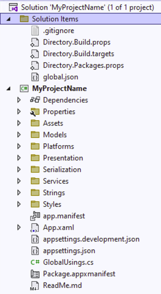
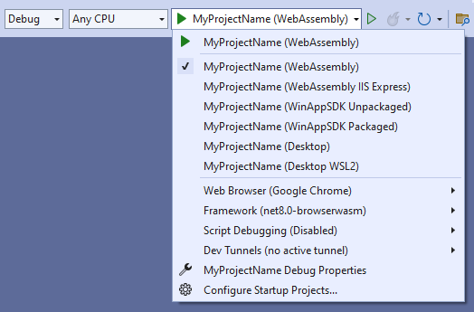

# How-To: Creating an application with Uno.Extensions

This tutorial will walk through how to create an Uno application with the `dotnet new` tool, which is already configured to use the Uno.Extensions.

> [!NOTE]
> Make sure to setup your environment first by [following our instructions](xref:Uno.GetStarted.vs2022).

## Step-by-steps

### 1. Exploring the Solution

The generated solution will contain:

* *MyProjectName* - for application logic, and other constructs like ViewModels and services, as well as the pages, controls, and other views that make up the UI of the application.
* *MyProjectName/Platforms* - platform-specific folders for each supported platform.

    

### 2. Running the Application

* Select a target from the drop-down as pictured below

    

* Click the "play" button, or press F5 to start debugging. The project will be compiled and deployed based on the target platform. For more detailed instructions specific to each platform, refer to the [Debug the App](xref:Uno.GettingStarted.CreateAnApp.VS2022#debug-the-app) documentation.
