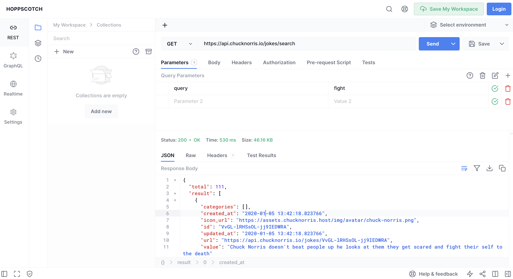
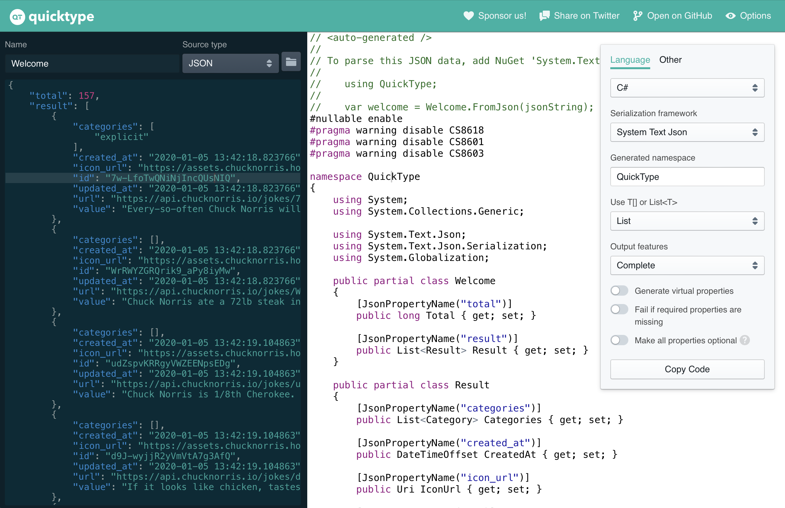

# How-To: Quickly Create a Strongly-Typed REST Client for an API

When accessing resources with a [REST-style](https://www.ics.uci.edu/~fielding/pubs/dissertation/rest_arch_style.htm) API is a significant part of your application, it is common to look for an SDK that provides a strongly-typed client for the API. This allows you to avoid writing boilerplate code to make requests and deserialize responses. There is sometimes no SDK available yet for the API you want to use, or it's not compatible with your target platform. With the design goal of avoiding boilerplate code in mind, we will walk through how to use [Refit](https://github.com/reactiveui/refit) to quickly create a strongly-typed client for a REST API and register it with the service collection as an endpoint.

## Step-by-step

[!include[create-application](../includes/create-application.md)]

### 1. Installation

* Add `Http` to the `<UnoFeatures>` property in the Class Library (.csproj) file.

    ```diff
    <UnoFeatures>
        Material;
        Extensions;
    +   Http;
        Toolkit;
        MVUX;
    </UnoFeatures>
    ```

### 2. Enable HTTP

* When working with a complex application, centralized registration of your API endpoints is a good practice. This allows you to easily change the endpoint for a given service. It also reduces the complexity to adding new services which can then have their `HttpClient` instance reused across multiple instances of view models or other services.

* The first step to centrally registering any API endpoint is to enable HTTP on the `IHostBuilder`:

    ```csharp
    protected override void OnLaunched(LaunchActivatedEventArgs args)
    {
        var appBuilder = this.CreateBuilder(args)
            .Configure(hostBuilder =>
            {
                hostBuilder.UseHttp();
            });
        ...
    }
    ```

* This feature requires the [Uno.Extensions.Http.WinUI](https://www.nuget.org/packages/Uno.Extensions.Http.WinUI) package. It uses [Microsoft Extensions](https://www.nuget.org/packages/Microsoft.Extensions.Http) for any HTTP-related [work](https://learn.microsoft.com/dotnet/architecture/microservices/implement-resilient-applications/use-httpclientfactory-to-implement-resilient-http-requests#benefits-of-using-ihttpclientfactory) such as naming or configuring the `HttpClient` instance associated with your endpoints.

### 3. Define the live interface

* For the purposes of this tutorial, we will create and register an interface for the Chuck Norris facts web API which is documented [here](https://api.chucknorris.io/)

* This interface will be used to generate the strongly-typed client. It will be used to make requests to the web service and deserialize responses.

* Start by defining an interface `IChuckNorrisEndpoint` with a method `Search()` that returns a `Task` of type `ApiResponse<ChuckNorrisData>`:

    ```csharp
    [Headers("Content-Type: application/json")]
    public interface IChuckNorrisEndpoint
    {
        [Get("/jokes/search")]
        Task<ApiResponse<ChuckNorrisData>> Search(CancellationToken ct, [AliasAs("query")] string searchTerm);
    }
    ```

    > [!NOTE]
    > A class named `ChuckNorrisData` will be defined in the next section of this guide. It will be used to deserialize the response from the API.

* The `Headers` attribute is used to specify the `Content-Type` header for the request. `Get` specifies the relative path for a `Search` request. Notice that the `searchTerm` parameter for the request is aliased as `query` using an `AliasAs` attribute.

* `ApiResponse<T>` is used to deserialize the response from the API. It is defined in the `Refit` package.

### 4. Generate a data model from the API response

* The next step is to generate a data model from the response we will get from the API. This will be used to deserialize the response which we'll learn is a JSON object with a `total` property and `result` that contains an array of Chuck Norris data objects.

* By the end of this section, a `ChuckNorrisData` class will be defined in the `Models` namespace to represent each object in the array.

* We will use [Hoppscotch](https://hoppscotch.io) to make an HTTP request and inspect the response. Open it, and make a `GET` request to the `/jokes/search` endpoint with the query parameter `query` set to `fight`.

  * Your screen should appear similar to this:

    

  * For informational purposes, this is the full HTTP request URL:

    ```http
    GET https://api.chucknorris.io/jokes/search?query=fight
    ```

  * The **response body** pane will populate with a formatted JSON object that looks similar to this:

    ```json
    {
        "total": 111,
        "result": [
            {
                "categories": [],
                "created_at": "2020-01-05 13:42:18.823766",
                "icon_url": "https://assets.chucknorris.host/img/avatar/chuck-norris.png",
                "id": "VvGL-lRHSsOL-jj9IEDWRA",
                "updated_at": "2020-01-05 13:42:18.823766",
                "url": "https://api.chucknorris.io/jokes/VvGL-lRHSsOL-jj9IEDWRA",
                "value": "Chuck Norris doesn't beat people up he looks at them they get scared and fight their self to the death"
            },
        ...
        ]
    }
    ```

  * Since this response is needed for the next step, copy the entire JSON object from the **response body** pane

* Next, we need to use a language-agnostic tool that infers a data model from the response we recieved. We will open [quicktype](https://app.quicktype.io/) and use it to generate a data model from the JSON we copied above

  * Replace any demo text in the left **JSON** pane with our text by pasting the JSON object into editor

  * Within the properties box on the right side, make the following selections:

    * **C#** as the _language_

    * **System Text Json**  as the _serialization framework_

    * **Complete** as the _output features_

  * Your screen should appear similar to this:

    

  * For the purposes of this tutorial, only select and copy the two model classes `Welcome` and `Result` from the right side containing the generated C# code.

    * What you copied should appear like this:

        ```csharp
        public partial class Welcome
        {
            [JsonPropertyName("total")]
            public long Total { get; set; }

            [JsonPropertyName("result")]
            public List<Result> Result { get; set; }
        }

        public partial class Result
        {
            [JsonPropertyName("categories")]
            public List<Category> Categories { get; set; }

            [JsonPropertyName("created_at")]
            public DateTimeOffset CreatedAt { get; set; }

            [JsonPropertyName("icon_url")]
            public Uri IconUrl { get; set; }

            [JsonPropertyName("id")]
            public string Id { get; set; }

            [JsonPropertyName("updated_at")]
            public DateTimeOffset UpdatedAt { get; set; }

            [JsonPropertyName("url")]
            public Uri Url { get; set; }

            [JsonPropertyName("value")]
            public string Value { get; set; }
        }
        ```

  * Go back to Visual Studio and create a new folder named `Models` in the shared project. Create a new file named `ChuckNorrisData.cs` in the `Models` folder and paste the code you copied into it.

  * Rename the partial classes `Welcome` to `ChuckNorrisData` and `Result` to `ChuckNorrisDataResult`

### 5. Register the endpoint

* Unlike standard HTTP endpoints, Refit endpoints you define will be registered as a service with the `AddRefitClient<T>()` extension method, where the type argument `T` corresponds to an interface you define.

* This extension method can take a delegate as its argument:

    ```csharp
    protected override void OnLaunched(LaunchActivatedEventArgs args)
    {
        var appBuilder = this.CreateBuilder(args)
            .Configure(hostBuilder =>
            {
                hostBuilder.UseHttp((context, services) =>
                    services.AddRefitClient<IChuckNorrisEndpoint>(context, httpClient =>
                    {
                        httpClient.BaseAddress = new Uri("https://api.chucknorris.io/");
                    })
                );
            });
        ...
    }
    ```

* Another way to configure an HTTP client is to specify a configuration section name. This allows you to configure the added HTTP client using the `appsettings.json` file. This tutorial demonstrates use of the configuration section method.

* Add the Refit client to the service collection with the following code instead:

    ```csharp
    protected override void OnLaunched(LaunchActivatedEventArgs args)
    {
        var appBuilder = this.CreateBuilder(args)
            .Configure(hostBuilder =>
            {
                hostBuilder.UseHttp((context, services) =>
                    services.AddRefitClient<IChuckNorrisEndpoint>(context)
                );
            });
        ...
    }
    ```

* Look for a file named `appsettings.json` in the shared project. If it does not exist, create it. Open this file and add the following JSON:

    ```json
    {
        "ChuckNorrisEndpoint": {
            "Url": "https://api.chucknorris.io/",
            "UseNativeHandler": true
        }
    }
    ```

* The `Url` property specifies the base URL for the API.

* We set `UseNativeHandler` to `true` to use the native HTTP handler for the platform. This is recommended for production apps unless you have a specific reason to use the managed handler.

  * On Windows, intercepting the network traffic of your app with tools like **Fiddler** is not possible when using the native handler. This is because it does not use a compatible network stack.

  * In these cases, you can set `UseNativeHandler` to `false` to use the managed handler instead

* That block of JSON from the above file is called a configuration section. In this case, it's used to configure the HTTP client associated with the endpoint. For more information, see the [overview](xref:Uno.Extensions.Configuration.Overview#sections) for configuration sections.

* Observe that the name of the configuration section is similar to that of the endpoint interface we defined earlier. By default, the interface name without the leading `I` prefix is assumed to be the section name. This can be overridden by specifying a name while registering the service. The name you use should be the second argument to `AddRefitClient<T>()`.

### 6. Use the endpoint

* `IChuckNorrisEndpoint` can now be used in a service implementation by injecting it into the constructor.  This interface will be used to make requests to the web service and deserialize responses.

* For the purposes of this tutorial, we will create a view model for the page that triggers the request for a Chuck Norris fact named `FactViewModel`. It will have a method `SearchAsync()` that returns a `Task` of type `ChuckNorrisData`:

    ```csharp
    public class FactViewModel
    {
        private readonly IChuckNorrisEndpoint _endpoint;

        public FactViewModel(IChuckNorrisEndpoint endpoint)
        {
            _endpoint = endpoint;
        }

        public async Task<ChuckNorrisData> SearchAsync(string searchTerm)
        {
            var response = await _endpoint.Search(CancellationToken.None, searchTerm);

            if (response.IsSuccessStatusCode && response.Content is not null)
            {
                // Return first result
                var content = response.Content;
                return content.Result[0];
            }

            _logger.LogError(response.Error, "An error occurred while retrieving the latest fact.");
            return Task.FromException<ChuckNorrisData>(response.Error);
        }
    }
    ```

* Now, any views that need to display a Chuck Norris fact can use the `FactViewModel` to retrieve one. Thanks to the use of Refit, the details of HTTP requests and deserialization are abstracted away from the view, and boilerplate code is avoided.

## See also

* [How-To: Consume a web API with HttpClient](xref:Uno.Development.ConsumeWebApi)
* [How-To: Register an Endpoint for HTTP Requests](xref:Uno.Extensions.Http.HowToHttp)
* [Overview: HTTP](xref:Uno.Extensions.Http.Overview)
* [Overview: Use HttpClientFactory to implement resilient HTTP requests](https://learn.microsoft.com/dotnet/architecture/microservices/implement-resilient-applications/use-httpclientfactory-to-implement-resilient-http-requests#benefits-of-using-ihttpclientfactory)
* [Overview: What is Refit?](https://github.com/reactiveui/refit)
* [Explore: Hoppscotch tool](https://hoppscotch.io)
* [Explore: quicktype tool](https://app.quicktype.io/)
* [Explore: TestHarness Refit Endpoints](https://github.com/unoplatform/uno.extensions/tree/main/testing/TestHarness/TestHarness.Shared/Ext/Http/Refit)
