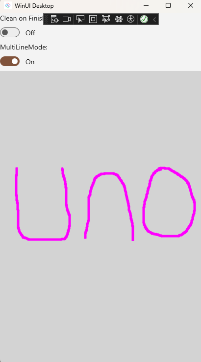

# .NET MAUI Embedding - MauiCommunityToolkit

The controls from MauiCommunityToolkit can be used in an Uno Platform application via .NET MAUI Embedding.

## Sample App

An existing sample app that showcases the controls is available [here](https://github.com/unoplatform/Uno.Samples/tree/master/UI/MauiEmbedding/MauiCommunityToolkitApp).

## Getting Started

1. Create a new application using the `unoapp` template, enabling .NET MAUI Embedding. In this case, we're going to use the Blank template (`-preset blank`) and include .NET MAUI Embedding support (`-maui`).

    ```dotnetcli
    dotnet new unoapp -preset blank -maui -o MauiEmbeddingApp
    ```

1. Add a reference to the [CommunityToolkit.Maui NuGet package](https://www.nuget.org/packages/CommunityToolkit.Maui) to the MauiEmbeddingApp.MauiControls project.

1. In the `AppBuilderExtensions` class, on `MauiEmbeddingApp.MauiControls` project, update the `UseMauiControls` extension method to call the `UseMauiCommunityToolkit` method.

    ```cs
    using CommunityToolkit.Maui;

    namespace MauiEmbeddingApp;

    public static class AppBuilderExtensions
    {
        public static MauiAppBuilder UseMauiControls(this MauiAppBuilder builder)
            => builder
                .UseMauiCommunityToolkit()
                .ConfigureFonts(fonts =>
                {
                    fonts.AddFont("MauiEmbeddingApp/Assets/Fonts/OpenSansRegular.ttf", "OpenSansRegular");
                    fonts.AddFont("MauiEmbeddingApp/Assets/Fonts/OpenSansSemibold.ttf", "OpenSansSemibold");
                });
    }
    ```

## Adding DrawingView

1. Update the EmbeddedControl.xaml in the `MauiEmbedding.MauiControls` project with the following XAML that includes the `DrawingView` control

    ```xml
    <?xml version="1.0" encoding="utf-8" ?>
    <ContentView xmlns="http://schemas.microsoft.com/dotnet/2021/maui"
                xmlns:x="http://schemas.microsoft.com/winfx/2009/xaml"
                xmlns:toolkit="http://schemas.microsoft.com/dotnet/2022/maui/toolkit"
                x:Class="MauiEmbeddingApp.MauiControls.EmbeddedControl"
                HorizontalOptions="Fill"
                VerticalOptions="Fill">
        <toolkit:DrawingView IsMultiLineModeEnabled="{Binding IsMultiLineModeEnabled}"
                            LineColor="Fuchsia"
                            LineWidth="5"
                            ShouldClearOnFinish="{Binding ShouldCleanOnFinish}" />
    </ContentView>
    ```

    > [!NOTE]
    > You may notice that the `Binding` markup extension is used on some properties. The `MauiEmbedding` can handle bindings between Maui Controls and UnoPlatform, just make sure the property in the `Binding` expression matches the property on your ViewModel.

1. Update the EmbeddedControl.xaml.cs with the following code.

    ```cs
    namespace MauiEmbeddingApp.MauiControls;

    public partial class EmbeddedControl : ContentView
    {
        public EmbeddedControl()
        {
            this.InitializeComponent();
        }
    }
    ```

1. Now let's create the controls that will control the `DrawingView.IsMultiLineModeEnabled` and `DrawingView.ShouldClearOnFinish` properties. Update the MainPage.xaml in the `MauiEmbeddingApp` project with the following xaml:

    ```xml
    <Page x:Class="MauiEmbeddingApp.MainPage"
        xmlns="http://schemas.microsoft.com/winfx/2006/xaml/presentation"
        xmlns:x="http://schemas.microsoft.com/winfx/2006/xaml"
        xmlns:d="http://schemas.microsoft.com/expression/blend/2008"
        xmlns:mc="http://schemas.openxmlformats.org/markup-compatibility/2006"
        mc:Ignorable="d"
        Background="{ThemeResource ApplicationPageBackgroundThemeBrush}">
        <Grid>
            <Grid.RowDefinitions>
                <RowDefinition Height="Auto" />
                <RowDefinition Height="*" />
            </Grid.RowDefinitions>
            <StackPanel>
                <TextBlock Text="Clean on Finish:" />
                <ToggleSwitch IsOn="{Binding ShouldCleanOnFinish, Mode=TwoWay}" />

                <TextBlock Text="MultiLineMode:" />
                <ToggleSwitch x:Name="MultiLineMode"
                            IsOn="{Binding IsMultiLineModeEnabled, Mode=TwoWay}" />
            </StackPanel>

            <embed:MauiHost xmlns:controls="using:MauiEmbeddingApp.MauiControls"
                            xmlns:embed="using:Uno.Extensions.Maui"
                            Grid.Row="1"
                            Source="controls:EmbeddedControl" />
        </Grid>
    </Page>
    ```

1. It's time to create the ViewModel that will hold the properties that will be data bound to the `DrawingView` control. On `MauiEmbeddingApp` project, create a new folder called `ViewModels` and add a new class called `MainViewModel`. This class will have the following code:

    ```cs
    namespace MauiEmbeddingApp.ViewModels;

    partial class MainViewModel : ObservableObject
    {
        [ObservableProperty]
        bool isMultiLineModeEnabled;

        [ObservableProperty]
        bool shouldCleanOnFinish;
    }
    ```

1. The `MainViewModel` uses the `ObservableObject` base class that comes from the `CommunityToolkit.MVVM` NuGet package. This significantly reduces the amount of boilerplate code required. Add a reference to the [CommunityToolkit.Mvvm NuGet package](https://www.nuget.org/packages/CommunityToolkit.Mvvm) to the MauiEmbeddingApp project.

1. The final step is to add the `MainViewModel` as the `DataContext` of the `Page` in the `MainPage.xaml` file. Here's how the final xaml should look.

    ```xml
    <Page x:Class="MauiEmbeddingApp.MainPage"
        xmlns="http://schemas.microsoft.com/winfx/2006/xaml/presentation"
        xmlns:x="http://schemas.microsoft.com/winfx/2006/xaml"
        xmlns:local="using:MauiEmbeddingApp.ViewModels"
        xmlns:d="http://schemas.microsoft.com/expression/blend/2008"
        xmlns:mc="http://schemas.openxmlformats.org/markup-compatibility/2006"
        mc:Ignorable="d"
        Background="{ThemeResource ApplicationPageBackgroundThemeBrush}">
        <Page.DataContext>
            <local:MainViewModel />
        </Page.DataContext>
        <Grid>
            <Grid.RowDefinitions>
                <RowDefinition Height="Auto" />
                <RowDefinition Height="*" />
            </Grid.RowDefinitions>
            <StackPanel>
                <TextBlock Text="Clean on Finish:" />
                <ToggleSwitch IsOn="{Binding ShouldCleanOnFinish, Mode=TwoWay}" />

                <TextBlock Text="MultiLineMode:" />
                <ToggleSwitch x:Name="MultiLineMode"
                            IsOn="{Binding IsMultiLineModeEnabled, Mode=TwoWay}" />
            </StackPanel>

            <embed:MauiHost xmlns:controls="using:MauiEmbeddingApp.MauiControls"
                            xmlns:embed="using:Uno.Extensions.Maui"
                            Grid.Row="1"
                            Source="controls:EmbeddedControl" />
        </Grid>
    </Page>
    ```

1. Now the project is good to go! Press F5 and you should see the `DrawingView` control working as expected. And tweaking the `ToggleSwitch` controls should change the `DrawingView` behavior.

## App Render Output

- **Android:**
  - 

- **Windows:**
  - 
