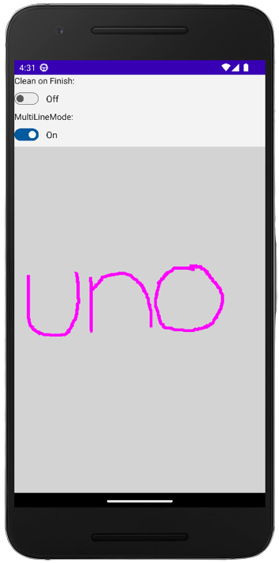

# .NET MAUI Embedding - MauiCommunityToolkit

The controls from MauiCommunityToolkit can be used in an Uno Platform application via .NET MAUI Embedding.

## Sample App

An existing sample app that showcases the controls is available [here](https://github.com/unoplatform/Uno.Samples/tree/master/UI/MauiEmbedding/MauiCommunityToolkitApp).

> [!NOTE]
> For this sample you don't need to have a license, because it's just a demo and for development purposes.
>
> MauiCommunityToolkitApp SDK for .NET is currently only compatible with Windows, Android, iOS, and Mac Catalyst when used with Uno Platform.

## Getting Started

1. Create a new application using the `unoapp` template, enabling .NET MAUI Embedding. In this case, we're going to use the Blank template (`-preset blank`) and include .NET MAUI Embedding support (`-maui`).

    ```dotnetcli
    dotnet new unoapp -preset blank -maui -o MauiCommunityToolkitApp
    ```
### [Visual Studio](#tab/vs)
> [!NOTE]
> If you don't have the **Uno Platform Extension for Visual Studio** installed, follow [these instructions](xref:Uno.GetStarted.vs2022).

- Launch **Visual Studio** and click on **Create new project** on the Start Window. Alternatively, if you're already in Visual Studio, click **New, Project** from the **File** menu.

- Type `Uno Platform` in the search box

- Click **Uno Platform App**, then **Next**

- Name the project `MauiCommunityToolkitApp` and click **Create**

At this point you'll enter the **Uno Platform Template Wizard**, giving you options to customize the generated application.

- Select **Blank** in **Presets** selection

- Select the **Platforms** tab and unselect **Desktop** and **Web Assembly** platforms

- Select the **Features** tab and click on **.NET MAUI Embedding**

 Click **Create** to complete the wizard

The template will create a solution with a single cross-platform project, named `MauiCommunityToolkitApp`, ready to run.

For more information on all the template options, see [Using the Uno Platform Template](xref:Uno.GettingStarted.UsingWizard).

### [Command Line](#tab/cli)

> [!NOTE]
> If you don't have the **Uno Platform dotnet new templates** installed, follow [dotnet new templates for Uno Platform](xref:Uno.GetStarted.dotnet-new).
Create a new application using the `unoapp` template, enabling .NET MAUI Embedding. In this case, we're going to use the Blank template (`-preset blank`) and include .NET MAUI Embedding support (`-maui`).

```bash
dotnet new unoapp -preset blank -maui -platforms "android" -platforms "ios" -platforms "maccatalyst" -platforms "windows" -o MauiCommunityToolkitApp
```

This will create a new folder called **MauiCommunityToolkitApp** containing the new application.

---

1. Add a reference to the [MauiCommunityToolkitApp.Maui NuGet package](https://www.nuget.org/packages/CommunityToolkit.Maui) to the MauiCommunityToolkitApp.MauiControls project.

1. In the `AppBuilderExtensions` class, on `MauiCommunityToolkitApp.MauiControls` project, update the `UseMauiControls` extension method to call the `UseMauiCommunityToolkit` method.

    ```cs
    using MauiCommunityToolkitApp.Maui;

    namespace MauiCommunityToolkitApp;

    public static class AppBuilderExtensions
    {
        public static MauiAppBuilder UseMauiControls(this MauiAppBuilder builder)
            => builder
                .UseMauiCommunityToolkit()
                .ConfigureFonts(fonts =>
                {
                    fonts.AddFont("MauiCommunityToolkitApp/Assets/Fonts/OpenSansRegular.ttf", "OpenSansRegular");
                    fonts.AddFont("MauiCommunityToolkitApp/Assets/Fonts/OpenSansSemibold.ttf", "OpenSansSemibold");
                });
    }
    ```

## Adding DrawingView

1. Update the EmbeddedControl.xaml in the `MauiEmbedding.MauiControls` project with the following XAML that includes the `DrawingView` control

    ```xml
    <?xml version="1.0" encoding="utf-8" ?>
    <ContentView xmlns="http://schemas.microsoft.com/dotnet/2021/maui"
                xmlns:x="http://schemas.microsoft.com/winfx/2009/xaml"
                xmlns:toolkit="http://schemas.microsoft.com/dotnet/2022/maui/toolkit"
                x:Class="MauiCommunityToolkitApp.MauiControls.EmbeddedControl"
                HorizontalOptions="Fill"
                VerticalOptions="Fill">
        <toolkit:DrawingView IsMultiLineModeEnabled="{Binding IsMultiLineModeEnabled}"
                            LineColor="Fuchsia"
                            LineWidth="5"
                            ShouldClearOnFinish="{Binding ShouldCleanOnFinish}" />
    </ContentView>
    ```

    > [!NOTE]
    > You may notice that the `Binding` markup extension is used on some properties. The `MauiEmbedding` can handle bindings between Maui Controls and UnoPlatform, just make sure the property in the `Binding` expression matches the property on your ViewModel.

1. Update the EmbeddedControl.xaml.cs with the following code.

    ```cs
    namespace MauiCommunityToolkitApp.MauiControls;

    public partial class EmbeddedControl : ContentView
    {
        public EmbeddedControl()
        {
            this.InitializeComponent();
        }
    }
    ```

1. Now let's create the controls that will control the `DrawingView.IsMultiLineModeEnabled` and `DrawingView.ShouldClearOnFinish` properties. Update the MainPage.xaml in the `MauiCommunityToolkitApp` project with the following xaml:

    ```xml
    <Page x:Class="MauiCommunityToolkitApp.MainPage"
        xmlns="http://schemas.microsoft.com/winfx/2006/xaml/presentation"
        xmlns:x="http://schemas.microsoft.com/winfx/2006/xaml"
        xmlns:d="http://schemas.microsoft.com/expression/blend/2008"
        xmlns:mc="http://schemas.openxmlformats.org/markup-compatibility/2006"
        mc:Ignorable="d"
        Background="{ThemeResource ApplicationPageBackgroundThemeBrush}">
        <Grid>
            <Grid.RowDefinitions>
                <RowDefinition Height="Auto" />
                <RowDefinition Height="*" />
            </Grid.RowDefinitions>
            <StackPanel>
                <TextBlock Text="Clean on Finish:" />
                <ToggleSwitch IsOn="{Binding ShouldCleanOnFinish, Mode=TwoWay}" />

                <TextBlock Text="MultiLineMode:" />
                <ToggleSwitch x:Name="MultiLineMode"
                            IsOn="{Binding IsMultiLineModeEnabled, Mode=TwoWay}" />
            </StackPanel>

            <embed:MauiHost xmlns:controls="using:MauiCommunityToolkitApp.MauiControls"
                            xmlns:embed="using:Uno.Extensions.Maui"
                            Grid.Row="1"
                            Source="controls:EmbeddedControl" />
        </Grid>
    </Page>
    ```

1. It's time to create the ViewModel that will hold the properties that will be data bound to the `DrawingView` control. On `MauiCommunityToolkitApp` project, create a new folder called `ViewModels` and add a new class called `MainViewModel`. This class will have the following code:

```cs
namespace MauiCommunityToolkitApp.ViewModels;

partial class MainViewModel : ObservableObject
{
	[ObservableProperty]
	bool isMultiLineModeEnabled;

	[ObservableProperty]
	bool shouldCleanOnFinish;
}
```

1. The `MainViewModel` uses the `ObservableObject` base class that comes from the `CommunityToolkit.MVVM` NuGet package. This significantly reduces the amount of boilerplate code required. Add a reference to the [CommunityToolkit.Mvvm NuGet package](https://www.nuget.org/packages/CommunityToolkit.Mvvm) to the MauiCommunityToolkitApp project.

1. The final step is to add the `MainViewModel` as the `DataContext` of the `Page` in the `MainPage.xaml` file. Here's how the final xaml should look.

    ```xml
    <Page x:Class="MauiCommunityToolkitApp.MainPage"
        xmlns="http://schemas.microsoft.com/winfx/2006/xaml/presentation"
        xmlns:x="http://schemas.microsoft.com/winfx/2006/xaml"
        xmlns:local="using:MauiCommunityToolkitApp.ViewModels"
        xmlns:d="http://schemas.microsoft.com/expression/blend/2008"
        xmlns:mc="http://schemas.openxmlformats.org/markup-compatibility/2006"
        mc:Ignorable="d"
        Background="{ThemeResource ApplicationPageBackgroundThemeBrush}">
        <Page.DataContext>
            <local:MainViewModel />
        </Page.DataContext>
        <Grid>
            <Grid.RowDefinitions>
                <RowDefinition Height="Auto" />
                <RowDefinition Height="*" />
            </Grid.RowDefinitions>
            <StackPanel>
                <TextBlock Text="Clean on Finish:" />
                <ToggleSwitch IsOn="{Binding ShouldCleanOnFinish, Mode=TwoWay}" />

                <TextBlock Text="MultiLineMode:" />
                <ToggleSwitch x:Name="MultiLineMode"
                            IsOn="{Binding IsMultiLineModeEnabled, Mode=TwoWay}" />
            </StackPanel>

            <embed:MauiHost xmlns:controls="using:MauiCommunityToolkitApp.MauiControls"
                            xmlns:embed="using:Uno.Extensions.Maui"
                            Grid.Row="1"
                            Source="controls:EmbeddedControl" />
        </Grid>
    </Page>
    ```

1. Now the project is good to go! Press F5 and you should see the `DrawingView` control working as expected. And tweaking the `ToggleSwitch` controls should change the `DrawingView` behavior.

For more detailed instructions specific to each platform, refer to the [Debug the App](xref:Uno.GettingStarted.CreateAnApp.VS2022#debug-the-app) documentation.

**App Render Output**

- **Android:**
  - 

- **Windows:**
  - 
