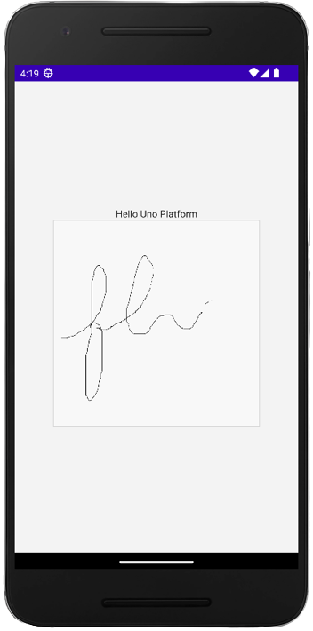
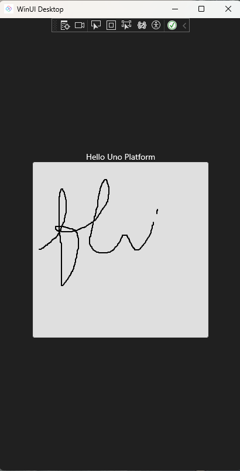

# .NET MAUI Embedding - Telerik UI for .NET MAUI

The controls in the Telerik UI for .NET MAUI can be used in an Uno Platform application via .NET MAUI Embedding. 

## Sample App

An existing sample app that showcases the controls is available [here](https://github.com/unoplatform/Uno.Samples/tree/master/UI/MauiEmbedding/TelerikApp).

## Installation

In order to use the Telerik controls, you first need to create an account and order a license to use the controls. You can find more instructions [here](https://www.telerik.com/). Then follow the instructions to have access to the private NuGet feed.

## Getting Started

1. Create a new application using the `unoapp` template, enabling .NET MAUI Embedding. In this case, we're going to use the Blank template (`-preset blank`) and include .NET MAUI Embedding support (`-maui`).

    ```
    dotnet new unoapp -preset blank -maui -o MauiEmbeddingApp
    ```

1. Next, add a reference to the `Telerik.UI.for.Maui` NuGet package to the `MauiEmbeddingApp.MauiControls` project.

1. In the `AppBuilderExtensions` class, on `MauiEmbeddingApp.MauiControls` project, update the `UseMauiControls` extension method to call the `UseTelerik` method.

    ```cs
    using Telerik.Maui.Controls;
    using Telerik.Maui.Controls.Compatibility;

    namespace MauiEmbeddingApp;

    public static class AppBuilderExtensions
    {
        public static MauiAppBuilder UseMauiControls(this MauiAppBuilder builder) 
            => builder
                .UseTelerik()
                .ConfigureFonts(fonts =>
                {
                    fonts.AddFont("MauiEmbeddingApp/Assets/Fonts/OpenSansRegular.ttf", "OpenSansRegular");
                    fonts.AddFont("MauiEmbeddingApp/Assets/Fonts/OpenSansSemibold.ttf", "OpenSansSemibold");
                });
    }
    ```

## Adding RadSignaturePad Control

1. Update the EmbeddedControl.xaml in the  `MauiEmbeddingApp.MauiControls` project with the following XAML that includes the `RadSignaturePad` control.

    ```xml
    <?xml version="1.0" encoding="utf-8" ?>
    <ContentView xmlns="http://schemas.microsoft.com/dotnet/2021/maui"
                xmlns:x="http://schemas.microsoft.com/winfx/2009/xaml"
                xmlns:telerik="http://schemas.telerik.com/2022/xaml/maui"
                x:Class="MauiEmbeddingApp.MauiControls.EmbeddedControl"
                HorizontalOptions="Fill"
                VerticalOptions="Fill">
            <telerik:RadSignaturePad x:Name="SignaturePad"
                                    HeightRequest="300"
                                    WidthRequest="300"
                                    BorderThickness="1"
                                    BorderColor="LightGray" />
    </ContentView>
    ```

1. Update the EmbeddedControl.xaml.cs with the following code. 

    ```cs
    namespace MauiEmbeddingApp.MauiControls;

    public partial class EmbeddedControl : ContentView
    {
        public EmbeddedControl()
        {
            InitializeComponent();
        }
    }
    ```

1. Now the project is good to go! Press F5 and you should see the `RadSignaturePad` control working as expected.

**App Render Output**

- **Android:**
  - 

- **Windows:**
  - 
