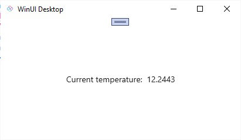
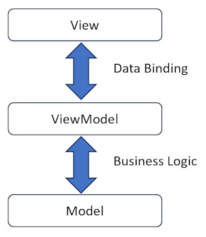
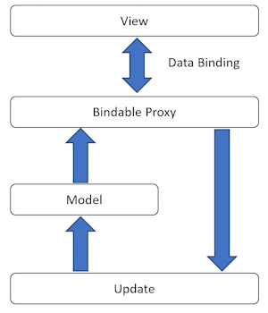

---
uid: Uno.Extensions.Mvux.Overview
---

# MVUX Overview

**M**odel, **V**iew, **U**pdate, e**X**tended (**MVUX**) is an implementation of the Model-View-Update design pattern, that encourages the flow of immutable data in a single direction. What differentiates MVUX from other MVU implementations is that it has been designed to support data binding. 


## Why MVUX?

To better understand the need for MVUX, let us consider a weather application that will display the current temperature, obtained from an external weather service. At face value, this seems simple enough. All the app has to do is call a service to retrieve latest temperature and display the returned value. 

### Weather App Example - MVVM

For example, using a Model-View-ViewModel (MVVM) approach, the following `MainViewModel` initializes the `CurrentWeather` property with the information obtained from the weather service. The XAML binds the `CurrentWeather` property of the `DataContext` (an instance of the `MainViewModel`) to the Text property of a TextBlock
  
# [MainViewModel](#tab/viewmodel)

```csharp
public partial class MainViewModel : ObservableObject
{
    private readonly IWeatherService _weather;

    [ObservableProperty]
    private WeatherInfo? _currentWeather;

    public MainViewModel(IWeatherService Weather)
    {
        _weather = Weather;
        _ = LoadWeather();
    }

    private async Task LoadWeather()
    {
        CurrentWeather = await _weather.GetCurrentWeather();
    }
}
```
The `ObservableObject` comes from the [`CommunityToolkit.Mvvm`](https://www.nuget.org/packages/CommunityToolkit.Mvvm) package and provides an implementation of the [`INotifyPropertyChanged`](https://learn.microsoft.com/windows/windows-app-sdk/api/winrt/microsoft.ui.xaml.data.inotifypropertychanged) interface, which is used to notify the UI when property values change. The `ObservableProperty` attribute (also from the `CommunityToolkit.Mvvm` package) is used to instruct the source code generator to emit properties that include raising the `PropertyChanged` event when the value changes. In this case the `CurrentWeather` property is generated, from the `_currentWeather` field, and will raise the `PropertyChanged` event when the value is set in the `LoadWeather` method.

# [MainPage](#tab/page)

```xml
<Page x:Class="WeatherSampleApp.MainPage"
	xmlns="http://schemas.microsoft.com/winfx/2006/xaml/presentation"
	xmlns:x="http://schemas.microsoft.com/winfx/2006/xaml">
	<StackPanel HorizontalAlignment="Center"
				VerticalAlignment="Center">
        <TextBlock>
            <Run Text="Current temperature: " />
            <Run Text="{Binding Data.Temperature}" />
        </TextBlock>
	</StackPanel>
</Page>
```
The DataContext on the MainPage is set to be an instance of the MainViewModel

```csharp
public MainPage()
{
    this.InitializeComponent();

    DataContext = new MainViewModel(new WeatherService());
}
```
----
Here's this simple application running:  



The code required to call the `GetCurrentWeather` and displaying the resulting `Temperature` using XAML is simple enough. However, there are a few things we should consider:

- If the `GetCurrentWeather` method takes a finite amount of time to complete, what should be displayed while the app is waiting for the result?
- If the `GetCurrentWeather` service fails, for example due to network issues, should the app display an error?
- If the `GetCurrentWeather` service returns no data, what should the app show?
- How can the user force the data to be refreshed?

The previous example has been updated in the following code to addresses these points. As you can see the updated code is significantly more complex than the original code.

# [MainViewModel](#tab/viewmodel)

```csharp
public partial class MainViewModel : ObservableObject
{
    private readonly IWeatherService _weather;

    [ObservableProperty]
    private WeatherInfo? _currentWeather;

    [ObservableProperty]
    private bool _isError;

    [ObservableProperty]
    private bool _noResults;

    public MainViewModel(IWeatherService Weather)
    {
        _weather = Weather;
        LoadWeatherCommand.Execute(default);
    }

    [RelayCommand]
    public async Task LoadWeather()
    {
        try
        {
            IsError = false;

            CurrentWeather = await _weather.GetCurrentWeather();
            NoResults = CurrentWeather is null;
        }
        catch
        {
            IsError = true;
        }
    }
}
```
`IsError` and `NoResults` properties are generated from the `_isError` and `_noResults` fields respectively. The `LoadWeather` method now has the `RelayCommand` attribute (also from the `CommunityToolkit.Mvvm` package) which will generate an [`ICommand`](https://learn.microsoft.com/windows/windows-app-sdk/api/winrt/microsoft.ui.xaml.input.icommand), `LoadWeatherCommand`. The `LoadWeatherCommand` implementation also includes an `IsRunning` property that returns true when the `ICommand` is being executed. The `IsError`, `NoResults` and `IsRunning` properties are used to control the visibility of the UI elements in the XAML.

# [MainPage](#tab/page)

```xml
<Page x:Class="WeatherSampleApp.MainPage"
	  xmlns="http://schemas.microsoft.com/winfx/2006/xaml/presentation"
	  xmlns:x="http://schemas.microsoft.com/winfx/2006/xaml">
	<StackPanel HorizontalAlignment="Center"
				VerticalAlignment="Center">
		<VisualStateManager.VisualStateGroups>
			<VisualStateGroup>
				<VisualState x:Name="LoadIsRunning">
					<VisualState.StateTriggers>
						<StateTrigger IsActive="{Binding LoadWeatherCommand.IsRunning}" />
					</VisualState.StateTriggers>
					<VisualState.Setters>
						<Setter Target="LoadingProgress.Visibility"
								Value="Visible" />
						<Setter Target="TemperatureTextBlock.Visibility"
								Value="Collapsed" />
					</VisualState.Setters>
				</VisualState>

				<VisualState x:Name="LoadError">
					<VisualState.StateTriggers>
						<StateTrigger IsActive="{Binding IsError}" />
					</VisualState.StateTriggers>
					<VisualState.Setters>
						<Setter Target="ErrorText.Visibility"
								Value="Visible" />
						<Setter Target="TemperatureTextBlock.Visibility"
								Value="Collapsed" />
					</VisualState.Setters>
				</VisualState>

				<VisualState x:Name="LoadNoResults">
					<VisualState.StateTriggers>
						<StateTrigger IsActive="{Binding NoResults}" />
					</VisualState.StateTriggers>
					<VisualState.Setters>
						<Setter Target="NoResultsText.Visibility"
								Value="Visible" />
						<Setter Target="TemperatureTextBlock.Visibility"
								Value="Collapsed" />
					</VisualState.Setters>
				</VisualState>

				<VisualState x:Name="LoadResults" />
			</VisualStateGroup>
		</VisualStateManager.VisualStateGroups>

		<TextBlock x:Name="ErrorText"
				   Visibility="Collapsed"
				   Text="Error" />
		<TextBlock x:Name="NoResultsText"
				   Visibility="Collapsed"
				   Text="No Results" />
		<ProgressRing x:Name="LoadingProgress"
					  Visibility="Collapsed" />

		<TextBlock x:Name="TemperatureTextBlock">
			<Run Text="Current temperature: " />
			<Run Text="{Binding CurrentWeather.Temperature}" />
		</TextBlock>
		<Button Command="{Binding LoadWeatherCommand}"
				Content="Get Weather" />
	</StackPanel>
</Page>
```  
The XAML includes four visual states which are triggered based on the value of `IsError`, `NoResults` and `LoadWeatherCommand.IsRunning`. The `Get Weather` Button is data bound to the `LoadWeatherCommand`, which will invoke the `LoadWeather` method when the Button is pressed.

----

Here's the updated application running, showing the progress ring in action while the data is loading and a Get Weather Button for refreshing the data.
  


This simple example illustrates how quickly simple code can grow in complexity when we consider the various states that an application can be in. 


### Weather App Example - MVUX

With Model-View-Update-eXtended (MVUX) we can simplify this code, making it easier to maintain and less error prone. Let's take a look at an equivalent weather application written using MVUX.

# [MainModel](#tab/model)

```csharp
public partial record MainModel(IWeatherService WeatherService)
{
    public IFeed<WeatherInfo> CurrentWeather => Feed.Async(this.WeatherService.GetCurrentWeather);
}
```
The `MainModel` (as distinct from the `MainViewModel` used in the MVVM example) includes a single `CurrentWeather` property that exposes an `IFeed` that will call `GetCurrentWeather` to retrieve the current weather. The `IFeed` interface is used to represent a stream, or sequence, of values that are loaded asynchronously.

# [MainPage](#tab/page)

```xml
<Page x:Class="WeatherSampleApp.MainPage"
	  xmlns="http://schemas.microsoft.com/winfx/2006/xaml/presentation"
	  xmlns:x="http://schemas.microsoft.com/winfx/2006/xaml"
	  xmlns:mvux="using:Uno.Extensions.Reactive.UI">
	<StackPanel HorizontalAlignment="Center"
				VerticalAlignment="Center">
		<mvux:FeedView Source="{Binding CurrentWeather}"
					   x:Name="WeatherFeedView">
			<mvux:FeedView.ValueTemplate>
				<DataTemplate>
					<TextBlock>
						<Run Text="Current temperature: " />
						<Run Text="{Binding Data.Temperature}" />
					</TextBlock>
				</DataTemplate>
			</mvux:FeedView.ValueTemplate>
			<mvux:FeedView.ProgressTemplate>
				<DataTemplate>
					<ProgressRing />
				</DataTemplate>
			</mvux:FeedView.ProgressTemplate>
			<mvux:FeedView.ErrorTemplate>
				<DataTemplate>
					<TextBlock Text="Error" />
				</DataTemplate>
			</mvux:FeedView.ErrorTemplate>
			<mvux:FeedView.NoneTemplate>
				<DataTemplate>
					<TextBlock Text="No Results" />
				</DataTemplate>
			</mvux:FeedView.NoneTemplate>
		</mvux:FeedView>
		<Button Content="Get Weather"
				Command="{Binding Refresh, ElementName=WeatherFeedView}" />
	</StackPanel>
</Page>
```
The `DataContext` on the `MainPage` is set to be an instance of the `BindableMainModel`, which is a bindable proxy for the `MainModel` that is generated by MVUX to provide data binding support to the `MainModel`. 

```csharp
public MainPage()
{
    this.InitializeComponent();

    DataContext = new BindableMainModel(new WeatherService());
}
```
----

Here's a quick summary of the changes:
- MainModel defines a single property `CurrentWeather` that returns an `IFeed` of type `WeatherInfo`.
- Instead of defining additional properties to reflect the state of the `GetCurrentWeather` call, this information is encapsulated in the `IFeed`.
- The `MainPage` XAML has been simplified to use the `FeedView` control, which automatically handles the various states of the `IFeed`.
- The `FeedView` control has a `Source` property that is bound to the `CurrentWeather` property of the `MainModel`.
- The `FeedView` control has a `ValueTemplate` that defines the UI to display when the `IFeed` has a value, `ProgressTemplate` that defines the UI to display when the `IFeed` is loading, `ErrorTemplate` that defines the UI to display when the feed has an error, and `NoneTemplate` that defines the UI to display when the `IFeed` has no results.
- The `Get Weather` Button is data bound to the `Refresh` command of the `FeedView` control, which will cause the `IFeed` to invoke the `GetCurrentWeather` method when the Button is pressed.

At this point, don't worry if you don't understand all of the details of the code. We'll cover this in more detail in the following sections. For now, it's important to understand that the `MainModel` code is much simpler than the previous `MainViewModel`, and that the `FeedView` control can be used to encapsulate the various visual states of the application.

## What is MVUX?

Now that you've seen an example of MVUX in action, let's discuss the main components of MVUX. 

### Model

As we saw in the example, a **Model** in MVUX (eg MainModel) is similar in many ways to a ViewModel in MVVM (eg MainViewModel). Both define the properties that will be available for data binding and any methods that will handle user interactions. 

In the context of MVUX the term **Model** also includes any data entities that are used by the application. For example, the `WeatherInfo` class, returned by the `GetCurrentWeather` method, is considered part of the **Model**.

In MVUX the entities that make up the **Model** are assumed to be immutable, meaning that both `MainModel` and `WeatherInfo` can be defined as `record` types. This is a key difference between MVUX and MVVM, where the ViewModel is typically mutable.

For the weather application example, `MainModel` is the **Model** for the `MainPage`, and defines a property named `CurrentWeather`.

```csharp
public partial record MainModel(IWeatherService WeatherService)
{
    public IFeed<WeatherInfo> CurrentWeather => Feed.Async(this.WeatherService.GetCurrentWeather);
}
```

The `CurrentWeather` property returns an `IFeed` of `WeatherInfo` entities. An `IFeed` represents a stream, or sequence, of values. For those familiar with [Reactive](https://reactivex.io/) this is similar to an `IObservable`. 

When the `CurrentWeather` property is accessed, an `IFeed` is created via the `Feed.Async` factory method, which will asynchronously call the `GetCurrentWeather` service, and return the result as a `WeatherInfo` entity.  

Feeds are covered in more detail in the [Feeds](xref:Uno.Extensions.Mvux.Feeds) documentation.

### View

In MVUX, the **View** is the UI, which can be written in XAML, C#, or a combination of the two. For example, the following can be used to data bind the `Text` property of a `TextBlock` to the `CurrentWeather.Temperature` property.

```xml
<Page x:Class="WeatherApp.MainPage"
        xmlns="http://schemas.microsoft.com/winfx/2006/xaml/presentation"
        xmlns:x="http://schemas.microsoft.com/winfx/2006/xaml">
	<StackPanel HorizontalAlignment="Center"
				VerticalAlignment="Center">
        <TextBlock>
            <Run Text="Current temperature: " />
            <Run Text="{Binding CurrentWeather.Temperature}" />
        </TextBlock>
	</StackPanel>
</Page>
```  

Unlike MVVM where the `DataContext` of the page would be set to an instance of the ViewModel, in MVUX the `DataContext` is set to an instance of a generated bindable proxy that wraps the **Model**. In this case, the bindable proxy for MainModel is named `BindableMainModel`.

```csharp
public MainPage()
{
    this.InitializeComponent();

    DataContext = new BindableMainModel(new WeatherService());
}
```

The generated `BindableMainModel` exposes the `IFeed` properties of the `MainModel` in a way that they can be data bound using simple data binding expressions, for example `{Binding CurrentWeather.Temperature}`. 

What's unique to MVUX is the additional information that `IFeed` exposes. The `IFeed` includes information about the state of the asynchronous operation, such as whether the operation is in progress, whether the operation returned data, or not, and whether there was an error. This information can be used to display the appropriate UI to the user.

To simplify working with an `IFeed`, we can leverage the MVUX `FeedView` control. The `FeedView` has been designed to work with `IFeed` sources and exposes an simple way for developers to define what the layout should be for the different states of the asynchronous operation.

The following XAML shows how the `FeedView` can be used to display the current temperature. The `Source` property is bound to the `CurrentWeather` property of the `BindableMainModel`. Inside the `DataTemplate` the `Data` property contains the data returned by the `CurrentWeather` property, which will be a `WeatherInfo` entity.

```xml
<Page x:Class="WeatherApp.MainPage"
    xmlns="http://schemas.microsoft.com/winfx/2006/xaml/presentation"
    xmlns:x="http://schemas.microsoft.com/winfx/2006/xaml"
    xmlns:mvux="using:Uno.Extensions.Reactive.UI">
    <StackPanel HorizontalAlignment="Center"
				VerticalAlignment="Center">
        <mvux:FeedView Source="{Binding CurrentWeather}">
            <mvux:FeedView.ValueTemplate>
                <DataTemplate>
                    <TextBlock>
                        <Run Text="Current temperature: " />
                        <Run Text="{Binding Data.Temperature}" />
                    </TextBlock>
                </DataTemplate>
            </mvux:FeedView.ValueTemplate>
        </mvux:FeedView>
    </StackPanel>
</Page>
```

The `FeedView` control has different visual states that align with the different states that an `IFeed` can be in (e.g. loading, refreshing, error, etc.). The above XAML defines the `ValueTemplate`, which is used when the `IFeed` has data. Other templates include `ProgressTemplate`, `ErrorTemplate` and `NoneTemplate` These automatically control what's displayed based on the state of the `IFeed`.

```xml
<Page x:Class="WeatherApp.MainPage"
    xmlns="http://schemas.microsoft.com/winfx/2006/xaml/presentation"
    xmlns:x="http://schemas.microsoft.com/winfx/2006/xaml"
    xmlns:mvux="using:Uno.Extensions.Reactive.UI">
    
    <mvux:FeedView Source="{Binding CurrentWeather}">
        <mvux:FeedView.ValueTemplate>
            <DataTemplate>
                <TextBlock>
                    <Run Text="Current temperature: " />
                    <Run Text="{Binding Data.Temperature}" />
                </TextBlock>
            </DataTemplate>
        </mvux:FeedView.ValueTemplate>
        <mvux:FeedView.ProgressTemplate>
            <DataTemplate>
                <ProgressRing />
            </DataTemplate>
        </mvux:FeedView.ProgressTemplate>
        <mvux:FeedView.ErrorTemplate>
            <DataTemplate>
                <TextBlock Text="Error" />
            </DataTemplate>
        </mvux:FeedView.ErrorTemplate>
        <mvux:FeedView.NoneTemplate>
            <DataTemplate>
                <TextBlock Text="No Results" />
            </DataTemplate>
        </mvux:FeedView.NoneTemplate>
    </mvux:FeedView>
</Page>
```

### Update

An **Update** is any action that will result in a change to the **Model**. Whilst an **Update** is often triggered via an interaction by the user with the **View**, such as editing text or clicking a button, an **Update** can also be triggered from a background process (for example a data sync operation or perhaps a notification triggered by a hardware sensor, such as a GPS).

We can make the weather example a bit more realistic by passing a city name as a parameter to the `GetCurrentWeather` service. In order for our `WeatherModel` to accept a user entered city, it needs to define an `IState` property, `City`.

```csharp
public partial record MainModel(IWeatherService WeatherService)
{
    public IState<string> City => State<string>.Empty(this);
    ...
}
```

An `IState` is a special type of property that is used to store state. The bindable proxy generated for the `MainModel` will now include a `City` property that can be two-way data bound in order to accept user input.

```xml
<TextBox Text="{Binding City, Mode=TwoWay}" />
```

The `City` property can now be combined with the `CurrentWeather` property in order to pass the city name to the `GetCurrentWeather` service. The `IFeed` returned by the `CurrentWeather` property will now await the `City` property and pass the value to the `GetCurrentWeather` service. 

```csharp
public IFeed<WeatherInfo> CurrentWeather => Feed.Async(async ct =>
{
    var city = await City;
    if (city is not null)
    {
        return await this.WeatherService.GetCurrentWeather(city, ct);
    }
    return default;
});
```

This can be expressed in a more declarative way using the `SelectAsync` extension method. As the value of the `City` property changes, the `SelectAsync` method will automatically trigger a refresh of the `CurrentWeather` feed. The `GetCurrentWeather` method will be invoked, passing the current value of the `City` property.

```csharp
public IFeed<WeatherInfo> CurrentWeather => City.SelectAsync(this.WeatherService.GetCurrentWeather);
```

This is just one example of how user input can be accepted in order to trigger a change to the **Model**. Another example is for a `Button` to trigger a refresh of the weather data, which was shown earlier with the `Get Weather` Button that was data bound to the `Refresh` command on the `FeedView`.


### eXtended

In summary, MVUX is a set of abstractions that are designed to work well with the data binding engine. The use of `IFeed` and `IState` properties allow the **Model** to be expressed more declaratively. The source code generator then generates bindable proxies for each **Model**. The bindable proxies are used as a bridge that enables immutable entities to work with the data-binding engine.

#### MVVM vs MVUX Data Flow
The Model-View-ViewModel (MVVM) pattern is a popular pattern for building XAML applications. The MVVM pattern is a specialization of the Presentation Model pattern, where the **ViewModel** is responsible for exposing data from the **Model** to the **View**. The **ViewModel** is also responsible for handling user interactions and updating the **Model**. The **ViewModel** is often referred to as the glue between the **Model** and the **View**.  



The Model-View-Update-eXtended (MVUX) pattern still leverages data binding to present information to the user and capture input. However, instead of being bound directly to the **Model**, the **View** is data bound to bindable proxies that are generated by MVUX. It's the use of bindable proxies that ensure the single direction of flow of data. When an update occurs, either by the user triggering an action, or entering some data, this generates new instances of the **Model**. The bindable proxies then detect the change and update the **View** accordingly. The bindable proxies also ensure that the **Model** is updated in a thread-safe manner.
 


#### Key points
- Feeds are reactive in nature.
- Models and associated entities are immutable.
- Operations are asynchronous by default.
- Feeds include additional information such as loading, if there's data or if an error occurred.
- States are used to accept input from the user and can be two-way data bound.
- MVUX combines the unidirectional flow of data of MVU, with the data binding capabilities of MVVM.


## Creating your own

You can get started with MVUX by creating a new project. Follow the [How to set up an MVUX project](xref:Uno.Extensions.Mvux.HowToMvuxProject) tutorial to get started.

You can then use the MVUX example above as a reference to create your own `IFeed` and `IState` properties, and use the `FeedView` to display data.

### In the Model

- Define your own Models
- MVUX recommends using record types for the Models in your app as they're immutable.
- The MVUX analyzers auto-generate a bindable proxy for each `partial` `class` or `record` named with a _Model_ suffix.
- For every public [`IFeed`](xref:Uno.Extensions.Mvux.Feeds) property found in the model, a corresponding property is generated on the bindable proxy.
- You can use [`IState`](xref:Uno.Extensions.Mvux.States) properties to accepting input from the user.

### In the View

- Create your views and add data binding to the XAML elements as required
- Customize the layout of your application using the [FeedView](xref:Uno.Extensions.Mvux.FeedView) control.
- Use two-way binding to a state to allow input from the user

## WeatherApp Sample

You can find the code for our weather app [here](https://github.com/unoplatform/Uno.Samples/tree/master/UI/MvuxHowTos/WeatherApp).

