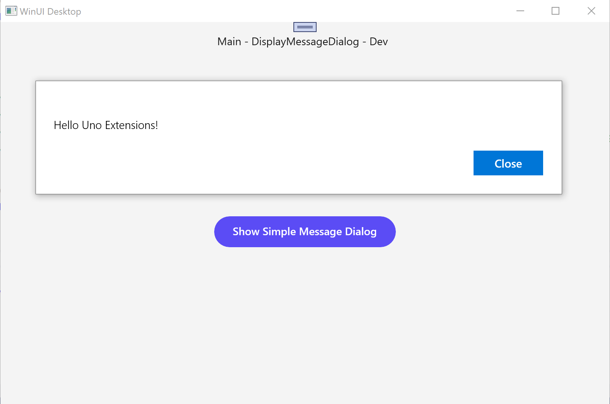
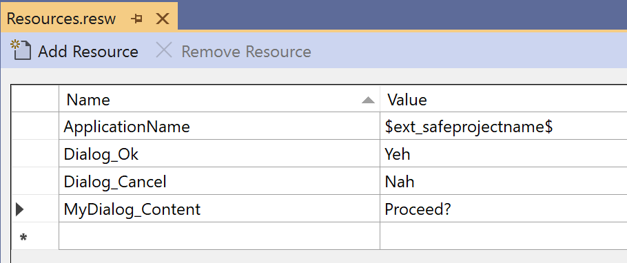

# How-To: Display a Message Dialog

This topic walks through using Navigation to display a prompt using a `MessageDialog`. This can also be used for simple user interactions, such as a confirmation dialog, where the user is prompted with an Ok/Cancel, or Yes/No, question.

## Step-by-steps

> [!IMPORTANT]
> This guide assumes you used the template wizard or `dotnet new unoapp` to create your solution. If not, it is recommended that you follow the [**Creating an application with Uno.Extensions** documentation](xref:Uno.Extensions.HowToGettingStarted) to create an application from the template.

### 1. Show an ad-hoc `MessageDialog`

- Update the existing `Button` on `MainPage.xaml`

    ```xml
    <Button Content="Show Simple Message Dialog"
            Click="{x:Bind ViewModel.ShowSimpleDialog}"
            Grid.Row="1"
            HorizontalAlignment="Center"
            VerticalAlignment="Center" />
    ```

- Add `ShowSimpleDialog` method to `MainViewModel`

    ```csharp
    public async Task ShowSimpleDialog()
    {
        _ = _navigator.ShowMessageDialogAsync(this, title: "This is Uno", content: "Hello Uno.Extensions!");
    }
    ```

    Run the application to see a `MessageDialog` displayed when you click the `Button`.

    

### 2. Accessing the `MessageDialog` response

- Change code in the `ShowSimpleDialog` method to await response

    ```csharp
    public async Task ShowSimpleDialog()
    {
        var result = await _navigator.ShowMessageDialogAsync<string>(this, title: "This is Uno", content: "Hello Uno.Extensions!");
    }
    ```

- Modify the `ShowMessageDialogAsync` method call to specify multiple buttons.

    ```csharp
    public async Task ShowSimpleDialog()
    {
     var result = await _navigator.ShowMessageDialogAsync<string>(this,
      title: "This is Uno",
      content: "Hello Uno.Extensions!",
      buttons: new[]
            {
       new DialogAction("Ok"),
       new DialogAction("Cancel")
            });
    }
    ```

    The `result` variable will be set to the label of the selected button.

    

### 3. Using predefined `MessageDialog`

If you want to use the same `MessageDialog` in different places in your application you can define a `MessageDialogViewMap` and then reference it by the route you assign to it.

- Create a `MessageDialogViewMap` instance and register it with both `views` and `routes` in `App.xaml.host.cs`

    ```csharp
    private static void RegisterRoutes(IViewRegistry views, IRouteRegistry routes)
    {
        var messageDialog = new MessageDialogViewMap(
            title: "This is Uno",
            Content: "Hello Uno.Extensions",
            Buttons: new[]
            {
                new DialogAction(Label:"Yes"),
                new DialogAction(Label:"No")
            }
        );


     views.Register(
      new ViewMap<ShellControl,ShellViewModel>(),
      new ViewMap<MainPage, MainViewModel>(),
      new ViewMap<SecondPage, SecondViewModel>(),
            messageDialog
      );

     routes
      .Register(
       new RouteMap("", View: views.FindByViewModel<ShellViewModel>() ,
                    Nested: new RouteMap[]
                    {
                     new RouteMap("Main", View: views.FindByViewModel<MainViewModel>()),
                     new RouteMap("Second", View: views.FindByViewModel<SecondViewModel>()),
                        new RouteMap("MyMessage", View: messageDialog)
                    }));
    }
    ```

- In `MainViewModel` change the `ShowMessageDialogAsync` method to specify the `route` argument, which should be the route specified in the `RouteMap`

    ```csharp
    var result = await _navigator.ShowMessageDialogAsync<string>(this, route: "MyMessage");
    ```

### 4. Localize the `MessageDialog`

- For a localized `MessageDialog` create a `LocalizableMessageDialogViewMap` instance and register it with both `views` and `routes` (as per previous step). Note that each of the properties in the `LocalizableMessageDialogViewMap` that were a simple `string` in the `MessageDialogViewMap`, are now call-back methods that provide an `IStringLocalizer` instance.

    ```csharp
    var localizedMessageDialog = new LocalizableMessageDialogViewMap(
        Content: localizer => localizer?["MyDialog_Content"]??string.Empty,
     Buttons: new[]
        {
      new LocalizableDialogAction( LabelProvider:localizer=>localizer?["Dialog_Ok"]??string.Empty),
            new LocalizableDialogAction( LabelProvider:localizer=>localizer?["Dialog_Cancel"]??string.Empty)
        }
    );
    ```

- Add resources for `MyDialog_Content`, `Dialog_Ok` and `Dialog_Cancel` to `Resources.resw`
    

- Make sure the `UseLocalization` extension method is called in the `BuildAppHost` method in `App.xaml.host.cs`

    ```csharp
    private static IHost BuildAppHost()
    {
     return UnoHost
       .CreateDefaultBuilder()
       // ... omitted for brevity
       .UseLocalization()
       .Build(enableUnoLogging: true);

    }
    ```

- In `MainViewModel` change the `ShowMessageDialogAsync` method to use the `MyLocalizedMessage` route (this route should match the name of the route that was added to the `routes` earlier).

    ```csharp
    var result = await _navigator.ShowMessageDialogAsync<string>(this, route: "MyLocalizedMessage");
    ```
